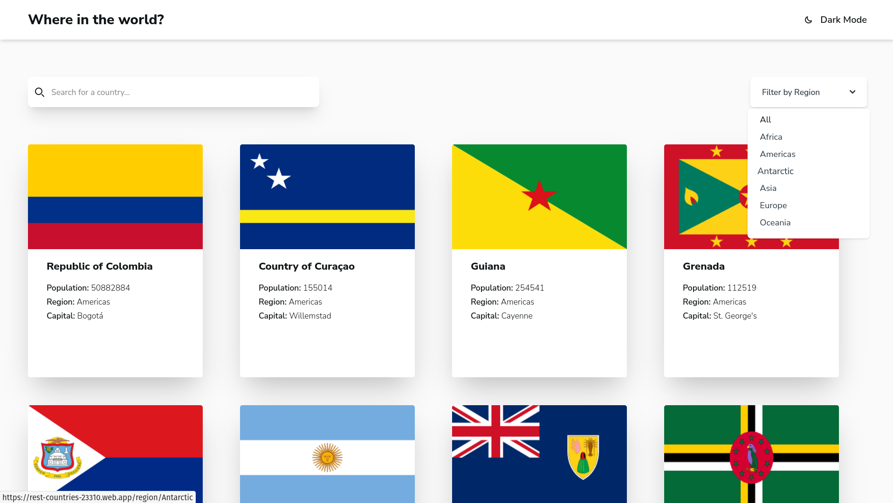
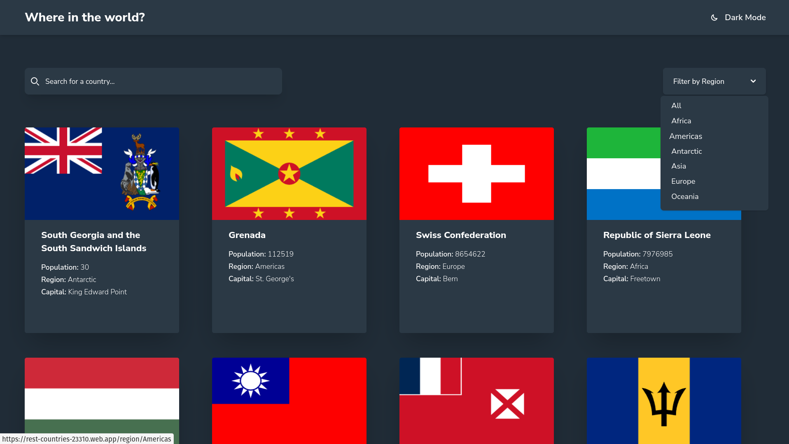
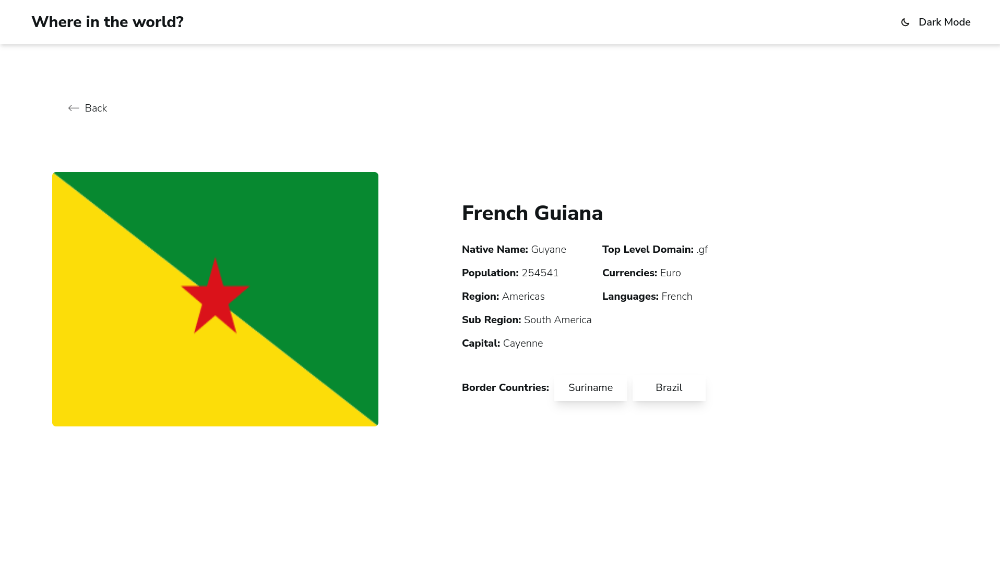
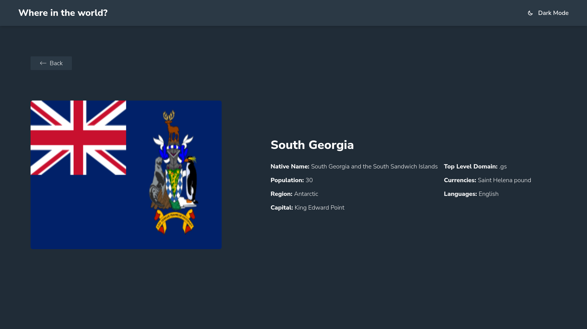
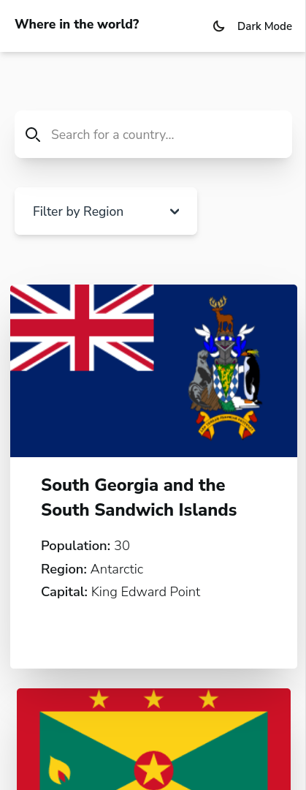
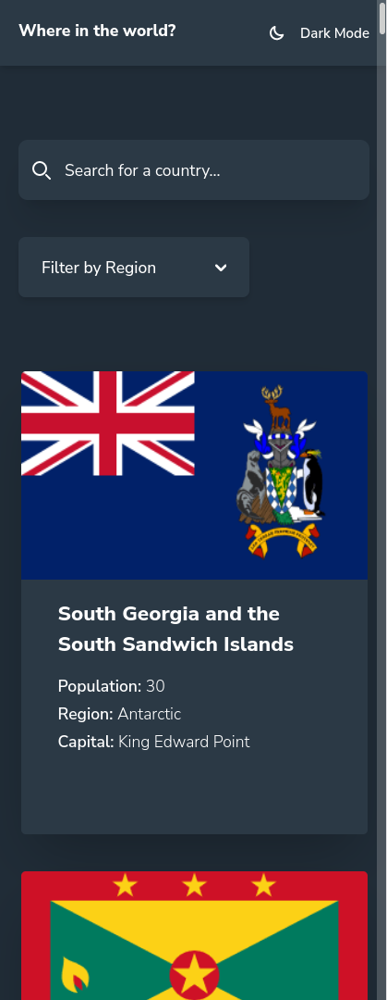

# Frontend Mentor - REST Countries API with color theme switcher solution

This is a solution to the [REST Countries API with color theme switcher challenge on Frontend Mentor](https://www.frontendmentor.io/challenges/rest-countries-api-with-color-theme-switcher-5cacc469fec04111f7b848ca). Frontend Mentor challenges help you improve your coding skills by building realistic projects. 

## Table of contents

- [Overview](#overview)
  - [The challenge](#the-challenge)
  - [Screenshot](#screenshot)
  - [Links](#links)
- [My process](#my-process)
  - [Built with](#built-with)
  - [What I learned](#what-i-learned)
  - [Continued development](#continued-development)
- [Author](#author)

## Overview

Website that uses the countries API, shows all countries, filters countries by region, allows you to search for countries and shows you the details of each one. As a bonus, it allows you to change the theme between light and dark.

### The challenge

Users should be able to:

- See all countries from the API on the homepage
- Search for a country using an `input` field
- Filter countries by region
- Click on a country to see more detailed information on a separate page
- Click through to the border countries on the detail page
- Toggle the color scheme between light and dark mode *(optional)*

### Screenshot

### Links

- Live Site URL: [Countries App](https://rest-countries-23310.web.app/)
- Solution URL: [Frontend Mentor](https://www.frontendmentor.io/solutions/countries-app-with-angular-and-tailwind-css-cI7OAwW0c_)

## My process

### Built with

- Semantic HTML5 markup
- CSS custom properties
- Flexbox
- CSS Grid
- Mobile-first workflow
- [Angular](https://v17.angular.io/docs) - JS Framework
- [Tailwind CSS](https://tailwindcss.com/) - CSS Framework

### What I learned

Deepen my knowledge in Angular

### Continued development

I would like to focus on the use of reactive programming with rxjs and the use of observables

## Author

- Website - [Laura Mesa](https://portfolio-app-three-red.vercel.app/)
- Frontend Mentor - [@laurymesa01](https://www.frontendmentor.io/profile/laurymesa01)
- Linkedin - [Laura Elena Mesa](https://www.linkedin.com/in/lauraelenamesa/)

